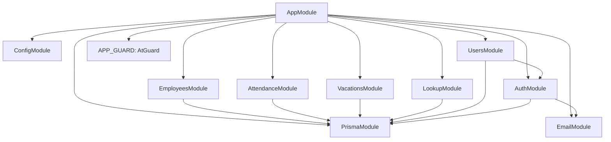
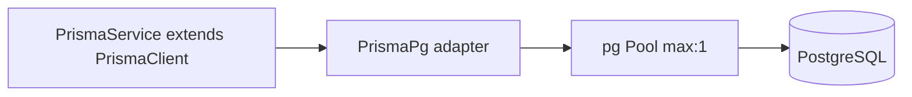
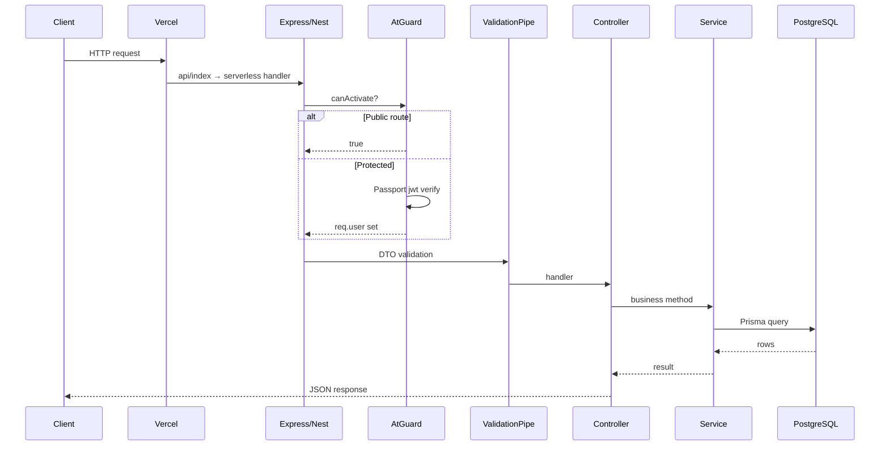

# Full Backend Architecture

## Folder structure (source)

```
hr_back/
├── api/index.ts              # Vercel entry → dist/src/serverless
├── prisma/schema.prisma      # Database schema
├── generated/prisma/         # Generated Prisma client (postinstall)
├── src/
│   ├── main.ts               # Local dev only (excluded from Vercel build)
│   ├── serverless.ts         # Vercel Nest + Express bootstrap
│   ├── app.module.ts         # Root module + global AtGuard
│   ├── app.config.ts         # ValidationPipe, CORS, Swagger
│   ├── app.controller.ts     # /, /health
│   ├── auth/                 # AuthModule
│   ├── users/
│   ├── employees/
│   ├── attendance/
│   ├── vacations/
│   ├── lookup/
│   └── common/
│       ├── prisma/           # @Global PrismaModule
│       ├── guards/
│       └── decorators/
├── vercel.json
├── tsconfig.vercel.json      # Excludes main.ts
└── swagger-spec.json         # Written at bootstrap
```

## Module architecture



### Global vs feature modules

| Module | `@Global()` | Notes |
|--------|-------------|--------|
| `PrismaModule` | Yes | `PrismaService` injectable everywhere |
| `ConfigModule` | `isGlobal: true` | `ConfigService` for `AT_SECRET`, etc. |
| Feature modules | No | Import only what they need |

## Dependency injection (how Nest wires things)

1. **Constructor injection:** `@Injectable()` services receive `PrismaService`, `AuthService`, etc.
2. **Module providers:** `AuthModule` registers `AuthService`, `AtStrategy`, `RtStrategy`.
3. **APP_GUARD:** `AppModule` registers `AtGuard` for every route unless `@MyPublic()`.
4. **Exports:** `AuthModule` exports `AuthService` for `UsersModule` password hashing.

Example chain for `GET /employees`:

```
EmployeesController → EmployeesService → PrismaService → PrismaClient → PostgreSQL
```

## Controller architecture

- One controller per feature, `@Controller('employees')` prefix.
- HTTP verbs map to service methods.
- Swagger decorators document contract; **runtime** validation is `ValidationPipe` + DTOs.
- Role checks: `@UseGuards(RolesGuard)` + `@Roles(UserRole.SUPER_ADMIN)` on sensitive routes.

## Service architecture

- **Business logic** lives in services, not controllers.
- Services use `PrismaService` (extends `PrismaClient`) for DB access.
- Nest converts Prisma errors to HTTP exceptions where handled (`P2025` → `NotFoundException`).

## Prisma architecture



- Client generated to `generated/prisma/` with `engineType = "binary"`.
- Connection config uses **discrete env vars** (`DB_HOST`, `DB_USERNAME`, …), not `DATABASE_URL` in schema (commented out in `schema.prisma`).
- **Singleton:** `globalForPrisma` reuses one `PrismaService` per Node process (critical for serverless warm instances).

## Shared cross-cutting pieces

| Piece | Location | Role |
|-------|----------|------|
| `AtGuard` | `common/guards/at.guard.ts` | JWT access on all routes |
| `RolesGuard` | `common/guards/roles.guard.ts` | Role hierarchy check |
| `MyPublic` | `common/decorators/public.decorator.ts` | Skip JWT |
| `Roles` | `common/decorators/roles.decorator.ts` | Required roles metadata |
| `AtAuthorizationHeader` | Swagger helper | Documents Bearer header |
| `configureApp` | `app.config.ts` | Pipes, CORS, Swagger |

## Request lifecycle (high level)



There is **no custom middleware** file in this project; CORS and validation are applied in `configureApp()`.

## Two runtime entry points

| Entry | File | When |
|-------|------|------|
| Local | `main.ts` | `npm run start:dev` → `listen(3000)` |
| Vercel | `serverless.ts` | All production traffic via rewrite |

Both call **`configureApp(app)`** so behavior matches.

## Design strengths

- Clear module boundaries for teaching and maintenance.
- Shared bootstrap (`app.config.ts`) avoids serverless/local drift.
- Global JWT with explicit opt-out (`@MyPublic()`).

## Design limitations

- No repository layer (services call Prisma directly).
- No unified API response envelope.
- Serverless + DB pooling requires careful ops (see serverless doc).
