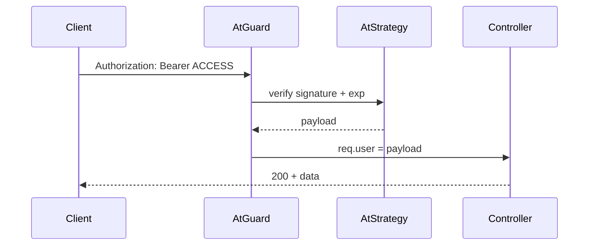
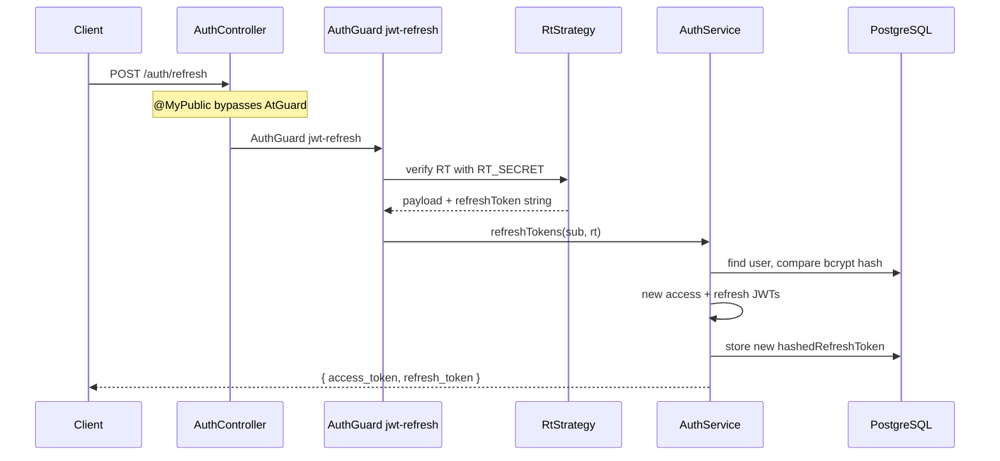

# Authentication System

All behavior described here comes from `src/auth/`, `src/common/guards/`, and `AppModule`.

---

## JWT architecture (dual token)

| Token | Secret env | Lifetime (code) | Storage |
|-------|------------|-----------------|---------|
| Access | `AT_SECRET` | `5 * 60` seconds (5 min) | Client only |
| Refresh | `RT_SECRET` | 30 days | Client + **bcrypt hash in DB** |

Payload (`JwtPayload`):

```typescript
{ sub: userId, email: string, role: UserRole }
```

**Why two tokens?**

- **Access token** is short-lived → limits damage if stolen from memory/logs.
- **Refresh token** allows silent renewal without re-entering password, but is **revocable** via DB hash.

---

## Access token flow



**Why `AtGuard` is global?**

Secure-by-default: new endpoints are protected unless explicitly `@MyPublic()`.

**Why `AtStrategy` name `'jwt'`?**

Matches `AuthGuard('jwt')` in `AtGuard extends AuthGuard('jwt')`.

---

## Refresh token flow



**Why `@MyPublic()` on refresh?**

Global `AtGuard` expects **access** JWT. Refresh endpoint must accept **refresh** JWT instead → bypass global guard, use `AuthGuard('jwt-refresh')`.

**Why hash refresh token in DB?**

If DB leaks, attacker still needs bcrypt crack. Stolen refresh from client can be invalidated on logout (hash set to `null`).

**Token rotation:** Each refresh issues **new** access + refresh and updates hash → old refresh token fails `bcrypt.compare`.

---

## Sign-in flow

1. `findUnique` by `email` OR `phone` (DTO `ValidateIf`).
2. `bcrypt.compare` password → else **401** (generic message — anti-enumeration partial).
3. If `approvalState === NOT_VERIFIED` → send OTP, return `{ verificationId, message }` (**no tokens**).
4. Else `getTokens` + `updateRtHash` → return tokens.

---

## OTP verification

- Code: `Math.floor(10000 + Math.random() * 90000)` → **5 digits**.
- Expiry: 10 minutes (`verificationCode_ExpiresAt`).
- Cooldown: ~1 minute between resends (derived from expiry − 10min + 1min).
- `POST /auth/verify` → validates code → sets `approvalState: VERIFIED` → issues tokens.

**Why OTP?**

Ensures email ownership before dashboard access (users created by SUPER_ADMIN still verify on first login).

---

## Password reset

Reuses same `verificationCode` fields:

- `POST /auth/request-reset-password` → `sendVerificationCode(userId)`.
- `POST /auth/reset-password` → requires `userId`, `email`, `code`, `newPassword` (extra email check).

**Why email in reset DTO?**

Defense in depth: attacker with only `userId` still needs matching email.

---

## Strategies

### `AtStrategy` (`jwt`)

- Extracts JWT from `Authorization: Bearer`.
- Secret: `ConfigService.get('AT_SECRET')`.
- `validate()` returns payload → `req.user`.

### `RtStrategy` (`jwt-refresh`)

- Same header location, different secret `RT_SECRET`.
- `passReqToCallback: true` → `validate(req, payload)` also passes raw refresh string for bcrypt check in service.

---

## Guards summary

| Guard | Scope | Purpose |
|-------|-------|---------|
| `AtGuard` | Global | Valid access JWT |
| `RolesGuard` | Selected controllers/methods | Role hierarchy |
| `AuthGuard('jwt-refresh')` | `POST /auth/refresh` only | Valid refresh JWT |

---

## Decorators

| Decorator | Effect |
|-----------|--------|
| `@MyPublic()` | Sets `isPublic` metadata → skip `AtGuard` |
| `@Roles(UserRole.SUPER_ADMIN)` | Metadata for `RolesGuard` |
| `@AtAuthorizationHeader()` | Swagger only (+ Bearer icon) |

---

## SUPER_ADMIN authorization

`RolesGuard` hierarchy:

```typescript
ADMIN: 1
SUPER_ADMIN: 2
```

`@Roles(UserRole.SUPER_ADMIN)` → required level 2 → only SUPER_ADMIN passes.

`@Roles(UserRole.ADMIN, UserRole.SUPER_ADMIN)` → min level 1 → both pass.

**Used on:**

- Entire `UsersController` (class-level guard + roles).
- `POST`/`PUT`/`DELETE` on `EmployeesController`.

**Why hierarchy instead of exact match?**

Allows declaring multiple acceptable roles with one rule; SUPER_ADMIN always ≥ ADMIN level.

---

## Public routes (actual)

| Route | Reason |
|-------|--------|
| `GET /`, `/health` | Ops / discovery |
| `POST /auth/local/signin` | Login |
| `POST /auth/verify` | OTP |
| `POST /auth/resend-verification-code` | OTP resend |
| `POST /auth/request-reset-password` | Reset flow |
| `POST /auth/reset-password` | Reset flow |
| `POST /auth/refresh` | Uses refresh guard, not access |

`POST /auth/logout` requires **valid access token** (not public).

---

## Security mechanisms — WHY each exists

| Mechanism | Why |
|-----------|-----|
| bcrypt passwords | Slow hash against brute force |
| bcrypt refresh hash | DB leak mitigation |
| Short access TTL | Stolen token window small |
| Refresh rotation | Detect reuse / force re-login |
| `@MyPublic()` explicit | Prevent accidental open routes |
| Generic 401 on login | Don't reveal if email exists (partial) |
| OTP cooldown | Abuse / email bombing mitigation |

---

## Weaknesses (honest)

- No refresh token family / reuse detection beyond rotation.
- `hashedAccessToken` column in schema **unused** in code.
- No rate limiting on sign-in / verify.
- 5-minute access TTL is aggressive — frontend must refresh often.

See [BACKEND_SECURITY_ANALYSIS.md](./BACKEND_SECURITY_ANALYSIS.md).
