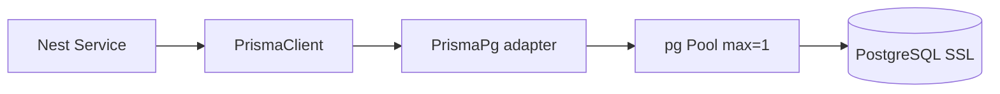
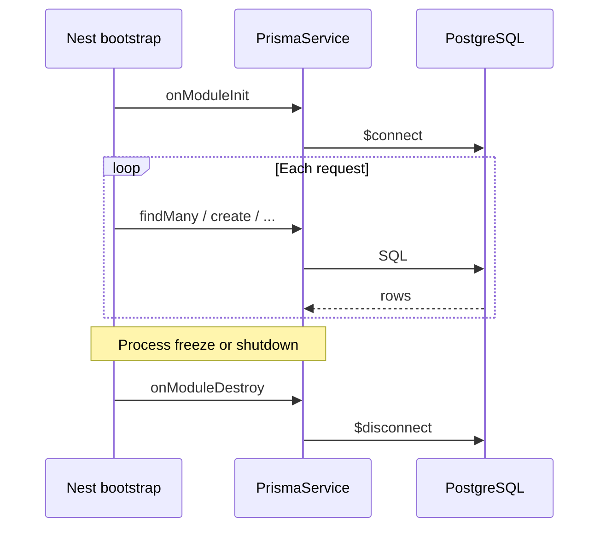

# Prisma & Database Analysis

## PrismaService (`src/common/prisma/prisma.service.ts`)

### What it does

```typescript
@Injectable()
export class PrismaService extends PrismaClient implements OnModuleInit, OnModuleDestroy
```

1. **Singleton per process:** If `globalForPrisma.prisma` exists, constructor returns that instance (serverless warm reuse).
2. **Adapter:** `new PrismaPg({ host, user, password, database, port, ssl, max: 1 })`.
3. **`super({ adapter, log: ['error'] })`** — Prisma 7 driver adapter mode.
4. **`onModuleInit`:** `$connect()`.
5. **`onModuleDestroy`:** `$disconnect()`.

### Why extend PrismaClient in a service?

Nest **injects** one shared DB client per app instance. Lifecycle hooks tie connection to Nest bootstrap/shutdown.

### Why `max: 1` on pg pool?

Serverless functions should not open many connections per instance. One pool slot reduces **“Too many clients”** risk (see serverless doc). Trade-off: queries run sequentially per connection.

---

## Prisma adapter & PostgreSQL



- **`@prisma/adapter-pg`:** Bridges Prisma engine to `node-postgres`.
- **SSL:** `rejectUnauthorized: false` — common for cloud Postgres (Aiven); **security trade-off** (MITM risk if network untrusted).

### Env vars (actual usage)

| Variable | Purpose |
|----------|---------|
| `DB_HOST` | Hostname |
| `DB_USERNAME` | User |
| `DB_PASSWORD` | Password |
| `DB_DATABASE` | Database name |
| `DB_PORT` | Port (number) |

`schema.prisma` has `url = env("DATABASE_URL")` **commented out** — runtime uses adapter config, not URL string in schema.

---

## Connection lifecycle



On Vercel, **disconnect may not run** on every invocation — platform may freeze the isolate. Singleton + `max: 1` mitigates connection explosion.

---

## Schema overview

### Users

- UUID `id`, unique `email`, optional `phone`.
- `hashedPassword`, `hashedRefreshToken` (used).
- `hashedAccessToken` — **in schema, not used in services**.
- `verificationCode`, `verificationCode_ExpiresAt` for OTP.
- `role`: `ADMIN` | `SUPER_ADMIN`.
- `approvalState`: `VERIFIED` | `NOT_VERIFIED`.

### Employees (core)

Large fact table (IBM attrition style): demographics, compensation, tenure, satisfaction FKs, `work_shift_id`.

**Relations loaded in list API** via `include`:

- `Department`, `JobRole`, `WorkShift`, `MaritalStatus`, `Education`, `BusinessTravel`
- Satisfaction relations: `EnvironmentSatisfaction`, `JobInvolvement`, `JobSatisfaction`, `PerformanceRating`, `RelationshipSat`, `WorkLifeBalance`

### Attendance_Logs

- `emp_id`, `shift_id`, `check_in`, `check_out` (nullable = still inside).

### Vacation_Request

- Date range, `reason`, `approval_status` → `RequestStatus`.
- `processed_by` → `Users.id` (optional until approved).

### Lookup tables

`MaritalStatus`, `DepartmentType`, `Education`, `JobRoleType`, `PerformanceRating`, `AttritionRiskClass`, `BusinessTravel`, `Satisfaction`, `RequestStatus`, `WorkShift` — mostly static IDs + `name` / `name_code`.

---

## How Prisma generates types

1. `prisma/schema.prisma` defines models.
2. `npx prisma generate` (via `postinstall`) writes to `generated/prisma/`.
3. Services import `Prisma`, `Employees`, enums from `generated/prisma/client`.

**Benefit:** Compile-time errors if you query nonexistent fields.

---

## Include / select patterns (actual)

| Endpoint | Pattern |
|----------|---------|
| `GET /employees` | Heavy `include` on all lookup relations |
| `GET /attendance/presence` | `include.Employee.select` + `Department` |
| `GET /attendance/employee/:id` | `include: { WorkShift: true }` |
| Vacation process | `include: Employee, RequestStatus, Processor` |

**Why include?**

Frontend gets labels (department name) without N+1 manual joins in application code.

**Cost:** Larger JSON payloads; acceptable for dashboard pages with pagination.

---

## Pagination strategy (`findAll`)

```typescript
skip = 0, take = 10  // defaults from DTO
findMany({ skip, take, where, orderBy, include })
count({ where })  // same filter, sequential awaits
```

Response:

```typescript
meta: { total, skip, take, pages: Math.ceil(total / take) }
```

**Why separate count?**

UI needs total pages; `findMany` alone doesn't return total matching rows.

---

## Filtering strategy

1. API query uses **camelCase** (`departmentId`, `minAge`).
2. Service maps to **snake_case** Prisma fields (`department_id`, `age: { gte, lte }`).
3. Undefined filters omitted from `where`.

### Known implementation issues (honest)

| DTO / filter key | Service maps to | In schema? |
|------------------|-----------------|------------|
| `minWorkloadPressureIndex` | `overload_pressure_index` | **Wrong** — should be `workload_pressure_index` |
| `minLateArrivalsLastMonth` | `late_arrivals_last_month` | **No column** — filter ignored by DB |
| `minAbsenceRatio`, absence days | various | **No columns** — not applied |

Students should understand: **DTO accepts params ≠ database filters them**.

---

## Aggregation strategy (`getStats`)

```typescript
prisma.employees.groupBy({
  by: [groupBy],  // e.g. 'department_id'
  _count: { id: true },
  _avg: { monthly_income, age, years_at_company, engagement_score, workload_pressure_index },
})
```

Mapped to friendly JSON: `group`, `count`, `averageSalary`, …

**Why groupBy IDs not names?**

SQL groups by FK; frontend resolves labels via lookup cache.

---

## Transactions

`deleteEmployee` uses `$transaction`:

1. `attendance_Logs.deleteMany`
2. `vacation_Request.deleteMany`
3. `employees.delete`

**Why?** FK constraints — children must be removed first.

---

## Prisma error codes used

| Code | Meaning | HTTP mapping |
|------|---------|--------------|
| P2002 | Unique violation | 400 / 409 |
| P2025 | Record not found | 404 |
| P2003 | FK violation | 400 |
| P2037 | Too many DB connections | 500 (runtime) |

---

## Why Prisma for this project (teaching)

| Alternative | Prisma advantage here |
|-------------|----------------------|
| Raw SQL | Faster for experts; Prisma safer for students + relations |
| TypeORM | Prisma schema + generate workflow is simpler for coursework |
| MongoDB | Data is inherently relational (employees ↔ departments) |

See [BACKEND_MODULES_ANALYSIS.md](./BACKEND_MODULES_ANALYSIS.md) for per-query walkthroughs.
