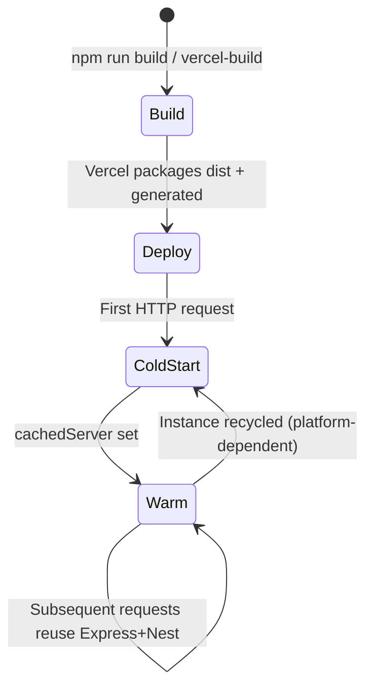
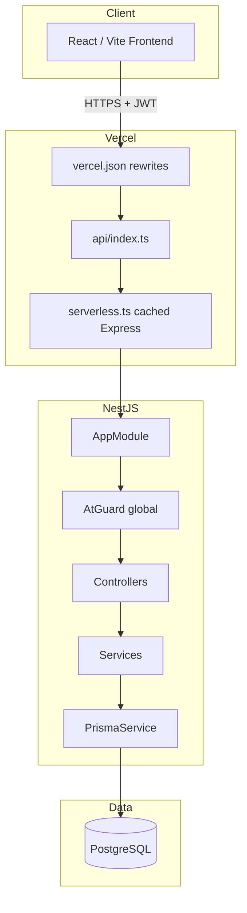

# HR Backend API — Educational Overview

> **Audience:** University project discussion, students learning NestJS + Prisma + serverless.  
> **Rule:** Everything below is derived from the actual repository implementation.

---

## 1. Project Overview

### What the backend does

This is a **REST API** for an HR analytics dashboard. It:

- Authenticates **admin users** (JWT + email OTP verification).
- Serves **employee attrition / HR metrics** (IBM-style dataset) with heavy filtering and analytics.
- Manages **attendance** (check-in/out “smart punch”).
- Manages **vacation requests** (submit, list, approve/reject).
- Exposes **lookup tables** for frontend dropdowns (departments, roles, shifts, etc.).

The frontend (`localhost:5173` / Netlify) consumes JSON over HTTPS with Bearer tokens.

### Business purpose

Support a dashboard where HR/admins can:

- Explore employee populations (filters, charts).
- Operate day-to-day HR workflows (attendance, leave).
- Manage system users (SUPER_ADMIN only).

### Main modules

| Module | Responsibility |
|--------|----------------|
| `AuthModule` | Sign-in, refresh, verify, reset password |
| `UsersModule` | Admin user CRUD (SUPER_ADMIN) |
| `EmployeesModule` | Core dataset + stats |
| `AttendanceModule` | Punch, presence, history |
| `VacationsModule` | Leave requests + processing |
| `LookupModule` | Reference data |
| `PrismaModule` | Global database access |

### Why NestJS?

- **Modular structure** maps cleanly to features (auth, employees, …).
- **Dependency injection** makes services testable and composable.
- **Guards, pipes, decorators** give a standard place for cross-cutting concerns (auth, validation).
- **Ecosystem** (Passport, Swagger, Config) fits enterprise-style APIs taught in courses.

### Why Prisma?

- **Type-safe queries** generated from `schema.prisma`.
- **Migrations & schema** as single source of truth for PostgreSQL.
- **Relations** (`include`, `groupBy`) without hand-written SQL for most endpoints.
- **Driver adapters** (here: `@prisma/adapter-pg`) for custom connection setup.

### Why PostgreSQL?

- Relational HR data (employees ↔ departments ↔ attendance).
- Strong filtering, aggregation, and FK integrity.
- Hosted on providers like **Aiven** (SSL, managed Postgres).

### Why serverless (Vercel)?

- **Low ops** for a university/demo deployment.
- **Pay-per-use** and easy CI/CD from Git.
- **Trade-off:** Cold starts, connection limits, and one Express instance per function — addressed via cached Nest bootstrap and `max: 1` on the `pg` pool (see `BACKEND_SERVERLESS_ANALYSIS.md`).

---

## 2. Technology stack (actual versions)

- NestJS 11, TypeScript 5.7
- Prisma 7 (`engineType = "binary"`, client in `generated/prisma/`)
- PostgreSQL via `pg` + `PrismaPg` adapter
- Passport JWT, bcrypt, class-validator
- Swagger (`@nestjs/swagger`)
- Vercel Node serverless (`@vercel/node`)

---

## 3. Documentation map

| File | Topic |
|------|--------|
| [BACKEND_ARCHITECTURE.md](./BACKEND_ARCHITECTURE.md) | Structure, DI, modules, diagrams |
| [BACKEND_REQUEST_LIFECYCLE.md](./BACKEND_REQUEST_LIFECYCLE.md) | Request path Vercel → DB → response |
| [BACKEND_AUTH_SYSTEM.md](./BACKEND_AUTH_SYSTEM.md) | JWT, guards, OTP, sequences |
| [BACKEND_DATABASE_ANALYSIS.md](./BACKEND_DATABASE_ANALYSIS.md) | Prisma, schema, queries |
| [BACKEND_SERVERLESS_ANALYSIS.md](./BACKEND_SERVERLESS_ANALYSIS.md) | Vercel, pooling, P2037 |
| [BACKEND_SECURITY_ANALYSIS.md](./BACKEND_SECURITY_ANALYSIS.md) | Threats and gaps |
| [BACKEND_MODULES_ANALYSIS.md](./BACKEND_MODULES_ANALYSIS.md) | Per-module deep dive |
| [BACKEND_RUNTIME_ISSUES.md](./BACKEND_RUNTIME_ISSUES.md) | Failures and fixes |
| [BACKEND_DEPLOYMENT_GUIDE.md](./BACKEND_DEPLOYMENT_GUIDE.md) | Build, env, Vercel |

Also: [COMPLETE_API_REFERENCE.md](./COMPLETE_API_REFERENCE.md), [FRONTEND_INTEGRATION_GUIDE.md](./FRONTEND_INTEGRATION_GUIDE.md).

---

## 4. Five lifecycles (summary)

### Backend lifecycle (application)

### Authentication lifecycle

1. Client `POST /auth/local/signin` → password check → optional OTP path or tokens.
2. Access token (5 min) on each API call via global `AtGuard`.
3. Before expiry, client `POST /auth/refresh` with refresh token (30 days, hashed in DB).
4. Logout clears `hashedRefreshToken`.

Details: [BACKEND_AUTH_SYSTEM.md](./BACKEND_AUTH_SYSTEM.md).

### Request lifecycle (one HTTP call)

Vercel rewrite → `api/index.ts` → `serverless.ts` → Nest → Guard → Pipe → Controller → Service → Prisma → PostgreSQL.

Details: [BACKEND_REQUEST_LIFECYCLE.md](./BACKEND_REQUEST_LIFECYCLE.md).

### Database lifecycle

`PrismaService` singleton (via `globalThis`) → `onModuleInit` → `$connect()` → queries per request → `onModuleDestroy` → `$disconnect()` (mainly on process exit).

Details: [BACKEND_DATABASE_ANALYSIS.md](./BACKEND_DATABASE_ANALYSIS.md).

### Serverless lifecycle

Function spin-up → `createNestServer()` once → `configureApp()` → `app.init()` → Express handles all routes until instance dies.

Details: [BACKEND_SERVERLESS_ANALYSIS.md](./BACKEND_SERVERLESS_ANALYSIS.md).

---

## 5. Architecture summary (one diagram)

---

## 6. Future improvements (honest list)

1. Strip `hashedPassword` from `GET /users` responses.
2. Use JWT `sub` for vacation `processed_by` instead of body `adminId`.
3. Fix employee filter typo: `overload_pressure_index` → `workload_pressure_index` in `employees.service.ts`.
4. Remove or implement DTO filters for non-existent columns (`late_arrivals_last_month`, absence fields).
5. Add rate limiting on auth endpoints.
6. Use `DATABASE_URL` or Prisma Data Proxy / PgBouncer for production connection pooling.
7. Add e2e tests and structured logging.
8. Align env naming in docs (`AT_SECRET` / `RT_SECRET` vs README `JWT_*`).

---

*End of overview — use linked files for chapter-level depth.*
