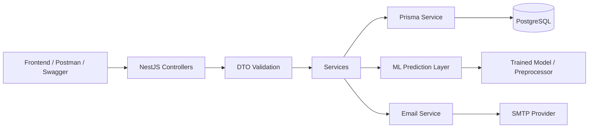
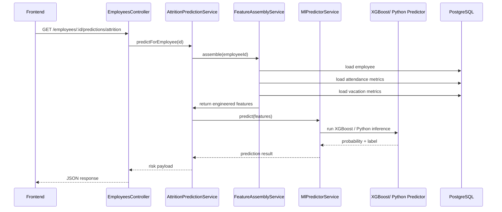
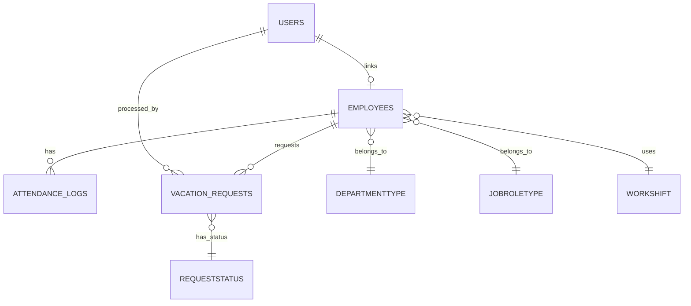

# Project Overview

This document is a complete technical documentation of the backend system for the HR analytics platform. It was generated by inspecting the actual codebase, Prisma schema, module structure, DTOs, services, authentication guards, deployment configuration, and the machine learning integration assets.

The documentation is intended for university students, graduation defense preparation, and technical review. Every explanation below is grounded in the implemented source files rather than assumptions.

## Purpose of the System

The backend exposes a REST API for:

- HR employee management
- Attendance tracking
- Vacation requests and approval workflow
- User and role administration
- JWT-based authentication and authorization
- Attrition risk prediction using machine learning

## Scope of This Document

The documentation covers:

- Architecture and modularity
- Database design and Prisma usage
- Authentication, authorization, and security
- Main business modules
- ML integration and prediction workflow
- Deployment strategy and environment considerations
- Newly added features compared with the older baseline

---

# Architecture

## High-Level Architecture

The system follows a layered NestJS architecture:

1. Client / Frontend sends HTTP requests.
2. NestJS controllers receive requests.
3. DTOs validate inputs.
4. Services contain business logic.
5. Prisma service interacts with PostgreSQL.
6. Responses are returned to the client in JSON.

The application is modular and uses the following high-level modules:

- Auth module
- Users module
- Employees module
- Attendance module
- Vacation module
- Lookup module
- ML module

## Architectural Style

The application uses:

- NestJS as the backend framework
- Dependency injection for modular organization
- Prisma ORM for database access
- JWT-based stateless authentication
- Role-based authorization guards
- Swagger/OpenAPI for API documentation

## Overall System Diagram



## Request Processing Flow

A typical request follows this path:

- HTTP request enters the NestJS app
- Global guard checks authentication unless the route is marked public
- Validation pipe validates DTOs
- Controller routes request to a service
- Service queries the database or triggers ML logic
- Prisma returns data from PostgreSQL
- Controller sends JSON response to the client

## Main Architectural Files

The central implementation files are:

- [src/app.module.ts](src/app.module.ts)
- [src/main.ts](src/main.ts)
- [src/app.config.ts](src/app.config.ts)
- [src/serverless.ts](src/serverless.ts)
- [src/common/guards/at.guard.ts](src/common/guards/at.guard.ts)
- [src/common/guards/roles.guard.ts](src/common/guards/roles.guard.ts)
- [prisma/schema.prisma](prisma/schema.prisma)

---

# Folder Structure

The project is organized as follows:

```text
src/
  app.module.ts
  app.controller.ts
  main.ts
  serverless.ts
  app.config.ts

  auth/
    auth.controller.ts
    auth.service.ts
    auth.module.ts
    dto/
    email/
    strategies/
    types/

  users/
    users.controller.ts
    users.service.ts
    dto/

  employees/
    employees.controller.ts
    employees.service.ts
    dto/
    entities/

  attendance/
    attendance.controller.ts
    attendance.service.ts
    dto/

  vacations/
    vacations.controller.ts
    vacations.service.ts
    dto/

  lookup/
    lookup.controller.ts
    lookup.service.ts

  ml/
    attrition-prediction.service.ts
    feature-assembly.service.ts
    ml-predictor.service.ts
    ml-preprocessor.service.ts
    python-predictor.service.ts
    xgboost-json-predictor.service.ts
    attendance-metrics.service.ts
    vacation-metrics.service.ts
    dto/

  common/
    decorators/
    dto/
    guards/
    prisma/

prisma/
  schema.prisma
  migrations/

models/
  classifier.json
  classifier.meta.json
  feature_schema.json
  preprocessor_config.json

Data mining/
  export_model.py
  export_xgboost_json.py
  predict.py
  employees_ml.csv
  models/
```

## Module Responsibilities

- Auth module: login, logout, token refresh, OTP verification, password reset
- Users module: admin management of user accounts
- Employees module: CRUD of employees and attrition prediction
- Attendance module: smart check-in / check-out and attendance history
- Vacations module: vacation request creation, listing, and approval
- Lookup module: dropdown and mapping values used by the frontend
- ML module: attrition risk prediction based on employee data and behavior metrics

---

# Technologies

## Backend Framework

The backend is built with NestJS.

Relevant dependencies are defined in [package.json](package.json).

## Main Technologies

- Node.js 20
- TypeScript
- NestJS
- Prisma ORM
- PostgreSQL
- Passport JWT
- bcrypt
- Swagger/OpenAPI
- Nodemailer
- Vercel serverless adapter

## Why These Technologies Were Chosen

- NestJS provides a structured and scalable backend architecture
- Prisma provides type-safe database access and migration support
- PostgreSQL is suitable for transactional HR data
- JWT provides stateless authentication
- Swagger supports API documentation and student demonstration
- Vercel compatibility was considered for deployment

---

# Database Design

The database is designed around an HR analytics model. The main ORM definition is in [prisma/schema.prisma](prisma/schema.prisma).

## Database Engine

The application uses PostgreSQL. The Prisma client is configured through [src/common/prisma/prisma.service.ts](src/common/prisma/prisma.service.ts).

## Core Database Concepts

The database stores:

- Users and authentication information
- Employees and HR attributes
- Attendance logs
- Vacation requests
- Lookup/reference tables for categorical values
- ML-related features and relationships

## Important Tables

### Users

Implemented in [prisma/schema.prisma](prisma/schema.prisma).

Fields include:

- id
- name
- role
- approvalState
- verificationCode
- verificationCode_ExpiresAt
- email
- phone
- hashedPassword
- hashedRefreshToken
- hashedAccessToken
- employee_id

Purpose:

- Stores application users
- Supports authentication and OTP verification
- Can be linked to an employee record

### Employees

Implemented in [prisma/schema.prisma](prisma/schema.prisma).

This table stores HR analytics data and includes:

- personal and demographic fields
- salary and compensation fields
- performance and satisfaction metrics
- tenure and role stability metrics
- attrition-related fields
- foreign keys to lookup tables

Important attributes include:

- attrition
- age
- gender
- monthly_income
- workload_pressure_index
- engagement_score
- attrition_risk_class_id
- work_shift_id

### Attendance_Logs

Implemented in [prisma/schema.prisma](prisma/schema.prisma).

Fields include:

- id
- emp_id
- check_in
- check_out
- shift_id

Purpose:

- Represents check-in / check-out events for employees
- Supports smart punching and presence tracking

### Vacation_Request

Implemented in [prisma/schema.prisma](prisma/schema.prisma).

Fields include:

- id
- emp_id
- processed_by
- processed_at
- requested_at
- start_date
- end_date
- reason
- approval_status

Purpose:

- Stores employee vacation requests
- Tracks who processed the request and when

### Lookup Tables

The system uses lookup tables such as:

- MaritalStatus
- BusinessTravel
- DepartmentType
- Education
- Satisfaction
- JobRoleType
- PerformanceRating
- AttritionRiskClass
- RequestStatus
- WorkShift

These tables provide normalized categorical values used by the frontend and ML features.

## Important Relations

### User ↔ Employee Relationship

The relation is implemented through the following fields:

- Users.employee_id
- Employees.User

This allows an employee account to be linked to a specific employee profile.

### Attendance Relations

- Attendance_Logs.emp_id → Employees.id
- Attendance_Logs.shift_id → WorkShift.id

This supports attendance history and shift-aware check-in logic.

### Vacation Relations

- Vacation_Request.emp_id → Employees.id
- Vacation_Request.processed_by → Users.id
- Vacation_Request.approval_status → RequestStatus.id

This supports employee requests and admin processing.

## Newly Added Database Fields and Concepts

The following are clearly reflected as new capabilities:

- employee_id in Users to link users to employees
- attendance logging with work shift relation
- vacation request processing with processor audit data
- attrition-focused employee features for ML prediction
- lookup tables for attrition risk classes and satisfaction scales

These are newly added capabilities in the current project evolution.

---

# Authentication

Authentication is implemented using JWT with Passport strategies.

## Authentication Flow

The login flow is implemented in [src/auth/auth.controller.ts](src/auth/auth.controller.ts) and [src/auth/auth.service.ts](src/auth/auth.service.ts).

## JWT

The backend uses:

- Access token for standard request authorization
- Refresh token for rotating sessions

The token creation logic is in [src/auth/auth.service.ts](src/auth/auth.service.ts).

## Access Token

The access token is used to authenticate protected endpoints. It is validated by [src/auth/strategies/at.strategy.ts](src/auth/strategies/at.strategy.ts).

## Refresh Token

The refresh token is used in the refresh endpoint and validated by [src/auth/strategies/rt.strategy.ts](src/auth/strategies/rt.strategy.ts).

## Password Hashing

Passwords are hashed with bcrypt before being stored. This is implemented in [src/auth/auth.service.ts](src/auth/auth.service.ts).

## OTP Verification

The system supports email-based verification using a numeric OTP.

The verification flow includes:

- send verification code
- verify account with code
- resend verification code
- password reset via verification code

Files involved:

- [src/auth/auth.controller.ts](src/auth/auth.controller.ts)
- [src/auth/auth.service.ts](src/auth/auth.service.ts)
- [src/auth/email/email.service.ts](src/auth/email/email.service.ts)
- [src/auth/dto/verification.dto.ts](src/auth/dto/verification.dto.ts)
- [src/auth/dto/reset-password.dto.ts](src/auth/dto/reset-password.dto.ts)

## Password Reset

Password reset uses the same OTP mechanism. The business logic is implemented in [src/auth/auth.service.ts](src/auth/auth.service.ts).

## Authentication Endpoints

- POST /auth/local/signin
- GET /auth/me
- POST /auth/logout
- POST /auth/refresh
- POST /auth/verify
- POST /auth/resend-verification-code
- POST /auth/request-reset-password
- POST /auth/reset-password

---

# Authorization

Authorization is implemented through:

- global JWT guard [src/common/guards/at.guard.ts](src/common/guards/at.guard.ts)
- role guard [src/common/guards/roles.guard.ts](src/common/guards/roles.guard.ts)
- custom public decorator [src/common/decorators/public.decorator.ts](src/common/decorators/public.decorator.ts)
- role decorator [src/common/decorators/roles.decorator.ts](src/common/decorators/roles.decorator.ts)

## Role System

The role enum is defined in [prisma/schema.prisma](prisma/schema.prisma) and includes:

- ADMIN
- SUPER_ADMIN
- EMPLOYEE

## Authorization Rule

- Public endpoints are open to everyone
- Authenticated users can access many protected endpoints
- SUPER_ADMIN has elevated rights for employee and user administration

## Access Control Implementation

The role hierarchy is implemented in [src/common/guards/roles.guard.ts](src/common/guards/roles.guard.ts).

---

# User Module

The user module handles administrative account management.

## Files

- [src/users/users.controller.ts](src/users/users.controller.ts)
- [src/users/users.service.ts](src/users/users.service.ts)
- [src/users/dto/create.user.dto.ts](src/users/dto/create.user.dto.ts)

## Responsibilities

- List and search users
- Create user accounts
- Delete user accounts
- Link user accounts to employee records

## Important Feature

This is a newly added feature: the backend can create user accounts that may be linked to employee records using employee_id.

## User Creation Flow

1. Frontend sends data to POST /users
2. DTO validates input
3. Service hashes password using bcrypt
4. User is stored in Prisma
5. Response returns success message

## Validation Rules

The DTO validates:

- name is required
- email format is valid
- password minimum length is 6
- role is optional but restricted to enum values
- employee_id is optional but must be compatible with employee role rules

---

# Employee Module

The employee module is one of the core modules of the system.

## Files

- [src/employees/employees.controller.ts](src/employees/employees.controller.ts)
- [src/employees/employees.service.ts](src/employees/employees.service.ts)
- [src/employees/dto/base.employee.dto.ts](src/employees/dto/base.employee.dto.ts)
- [src/employees/dto/create.employee.dto.ts](src/employees/dto/create.employee.dto.ts)
- [src/employees/dto/update.employee.dto.ts](src/employees/dto/update.employee.dto.ts)
- [src/employees/dto/employee-query.dto.ts](src/employees/dto/employee-query.dto.ts)

## Responsibilities

- Create employee profiles
- Update employee profiles
- Delete employees
- Search and filter employees
- Retrieve employee statistics
- Trigger ML attrition prediction

## Employee Querying

The GET /employees endpoint supports advanced query parameters including:

- pagination fields such as skip and take
- sorting by fields and direction
- range filters such as minAge, maxAge, monthly income, years at company
- categorical filters for department, role, work shift, and satisfaction values

## Employee Creation Flow

1. Frontend submits employee details
2. DTO validates the payload
3. Controller calls employeesService.createEmployee
4. Prisma creates a record in Employees
5. Response returns the created employee record

## Employee Deletion Flow

The deletion logic removes related attendance and vacation records first before deleting the employee. This is implemented in [src/employees/employees.service.ts](src/employees/employees.service.ts).

## Employee Stats

The GET /employees/stats route aggregates data by a chosen category.

---

# Attendance Module

The attendance module supports check-in and check-out workflows.

## Files

- [src/attendance/attendance.controller.ts](src/attendance/attendance.controller.ts)
- [src/attendance/attendance.service.ts](src/attendance/attendance.service.ts)
- [src/attendance/dto/punch.dto.ts](src/attendance/dto/punch.dto.ts)

## Business Logic

The system implements a smart punch model:

- If the employee already has an open attendance log with no check_out, the next punch closes the session
- Otherwise, the system creates a new check-in entry

## Why It Was Added

This is a newly added feature. It supports real-time employee presence tracking and HR reporting. It solves the problem of manual attendance logging.

## Main Endpoints

- POST /attendance/punch
- GET /attendance/presence
- GET /attendance/employee/:id

## Request Flow

1. Frontend calls POST /attendance/punch with employee ID
2. Controller forwards to attendance service
3. Service checks whether there is an open attendance log
4. Service either updates check_out or creates a check_in row
5. Prisma writes to Attendance_Logs
6. Response returns the attendance log

---

# Vacation Module

The vacation module supports vacation request submission and approval.

## Files

- [src/vacations/vacations.controller.ts](src/vacations/vacations.controller.ts)
- [src/vacations/vacations.service.ts](src/vacations/vacations.service.ts)
- [src/vacations/dto/create-vacation-request.dto.ts](src/vacations/dto/create-vacation-request.dto.ts)
- [src/vacations/dto/process-vacation-request.dto.ts](src/vacations/dto/process-vacation-request.dto.ts)

## Business Logic

The module:

- prevents requests for past dates
- prevents overlapping vacation requests
- stores requests in Vacation_Request
- allows admin processing through approval or rejection
- records processed_by and processed_at

## Why It Was Added

This is a newly added feature. It solves the problem of manual vacation approval and introduces structured request handling for HR processes.

## Main Endpoints

- POST /vacations
- GET /vacations/employee/:empId
- GET /vacations
- PATCH /vacations/:id/process

---

# Machine Learning Module

This is one of the most important additions to the project.

## Problem Statement

The system needs to support HR decision-making by predicting which employees are at risk of attrition. Manual review is slow and subjective. The ML module provides a data-driven prediction that can be shown in dashboards and used by HR staff.

## Why It Was Added

This is a newly added feature. It was added to solve the problem of proactive employee retention and workforce risk analysis.

## Dataset

The training dataset is based on the HR analytics dataset and is stored in:

- [data.mining/employees_ml.csv](data.mining/employees_ml.csv)
- [data.mining/datasets/Employees_Dataset_Final_With_Shifts.csv](data.mining/datasets/Employees_Dataset_Final_With_Shifts.csv)
- [data.mining/datasets/attendance_logs_updated.csv](data.mining/datasets/attendance_logs_updated.csv)
- [data.mining/datasets/vacation_requests_updated.csv](data.mining/datasets/vacation_requests_updated.csv)

## Features Used

The model uses employee attributes and behavioral metrics, including:

- age
- gender
- distance_from_home
- monthly_income
- percent_salary_hike
- job_level
- years_at_company
- training_times_last_year
- workload_pressure_index
- engagement_score
- overtime hours from attendance logs
- late arrivals
- absence days
- accepted/rejected vacation counts
- categorical lookup IDs such as department, role, education, satisfaction, work shift

These features are assembled in [src/ml/feature-assembly.service.ts](src/ml/feature-assembly.service.ts) and mapped in [src/ml/ml-feature.mapper.ts](src/ml/ml-feature.mapper.ts).

## Training Process

The training pipeline is implemented in [data.mining/export_model.py](data.mining/export_model.py).

The process includes:

- loading the dataset
- cleaning and transforming features
- creating train/test split
- preprocessing using StandardScaler and OneHotEncoder
- applying SMOTE to address class imbalance
- training an XGBoost classifier
- exporting the trained pipeline

## Model Type

The model is an XGBoost classifier.

Files related to the model:

- [models/classifier.json](models/classifier.json)
- [models/classifier.meta.json](models/classifier.meta.json)
- [models/feature_schema.json](models/feature_schema.json)
- [models/preprocessor_config.json](models/preprocessor_config.json)
- [data.mining/models/attrition_v1.joblib](data.mining/models/attrition_v1.joblib)

## Evaluation

The training script prints:

- best hyperparameters
- holdout accuracy
- exported model path

## Prediction API

The prediction endpoint is:

- GET /employees/:id/predictions/attrition

It is implemented in [src/employees/employees.controller.ts](src/employees/employees.controller.ts).

## Backend Integration

The ML module is registered in [src/app.module.ts](src/app.module.ts) through [src/ml/ml.module.ts](src/ml/ml.module.ts).

## ML Request Flow



## How the Backend Communicates with the Model

The backend uses two possible prediction strategies:

- JavaScript/XGBoost JSON inference in-process for Vercel-safe deployment
- Python inference when ML_BACKEND=python

The routing is implemented in [src/ml/ml-predictor.service.ts](src/ml/ml-predictor.service.ts).

## Request Handling Details

### 1. Feature assembly

The service loads:

- employee record
- attendance metrics from the last 30 days
- vacation counts by status

### 2. Feature transformation

The feature vector is transformed using the preprocessor config from [models/preprocessor_config.json](models/preprocessor_config.json).

### 3. Prediction

The predictor computes:

- predictedAttrition
- attritionProbability
- modelVersion

### 4. Risk mapping

The probability is mapped into Low, Medium, or High risk through [src/ml/ml-feature.mapper.ts](src/ml/ml-feature.mapper.ts).

## Returned Prediction Payload

The response includes:

- employeeId
- employeeName
- predictedAttrition
- attritionProbability
- riskLevel
- suggestedAttritionRiskClassId
- modelVersion
- computedAt

This is defined in [src/ml/dto/attrition-prediction-response.dto.ts](src/ml/dto/attrition-prediction-response.dto.ts).

## Error Handling

If the model is unavailable, the service raises a service unavailable error.

If the employee cannot be found, a NotFoundException is thrown.

## Deployment Considerations

The project was adapted to be deployable on Vercel. The old ONNX-based approach was later replaced by a more compact XGBoost JSON-based pipeline for size limitations.

This is reflected in:

- [data.mining/export_xgboost_json.py](data.mining/export_xgboost_json.py)
- [src/ml/xgboost-json-predictor.service.ts](src/ml/xgboost-json-predictor.service.ts)
- [vercel.json](vercel.json)

## Advantages

The ML integration provides:

- proactive retention planning
- better HR decision support
- personalized workforce analytics
- practical integration with employee data already in the system

## Future Improvements

Possible improvements include:

- expose the prediction as a dashboard widget
- retrain the model periodically with new HR data
- add explainability and SHAP-style reasons
- include confidence intervals and threshold tuning
- integrate into employee profile screens

---

# API Documentation

The API is documented with Swagger/OpenAPI through [src/app.config.ts](src/app.config.ts).

## Root and Health

| Method | URL | Purpose |
|---|---|---|
| GET | / | API root with documentation links |
| GET | /health | health check |
| GET | /swagger-spec.json | legacy redirect to OpenAPI JSON |

## Authentication Endpoints

| Method | URL | Request Body | Validation | Business Logic | Response |
|---|---|---|---|---|---|
| POST | /auth/local/signin | email or phone + password | DTO validation | Checks user, password, verification state | Returns tokens or verification-required payload |
| GET | /auth/me | none, Bearer token | JWT guard | Returns current authenticated user profile | User profile and linked employee |
| POST | /auth/logout | none, Bearer token | JWT guard | Clears refresh token | 204 No Content |
| POST | /auth/refresh | Bearer refresh token | JWT refresh strategy | Rotates tokens | New token pair |
| POST | /auth/verify | userId + code | DTO validation | Verifies OTP | New token pair |
| POST | /auth/resend-verification-code | userId | DTO validation | Sends new OTP | 204 No Content |
| POST | /auth/request-reset-password | userId | DTO validation | Sends reset OTP | 204 No Content |
| POST | /auth/reset-password | userId + code + email + newPassword | DTO validation | Resets password | 204 No Content |

## User Endpoints

| Method | URL | Request Body | Validation | Business Logic | Response |
|---|---|---|---|---|---|
| GET | /users | optional search query | none | List or search users | Array of users |
| POST | /users | user data | DTO validation | Creates a new user account | Success message |
| DELETE | /users/:id | none | UUID validation | Deletes a user | 204 No Content |

## Employee Endpoints

| Method | URL | Request Body | Validation | Business Logic | Response |
|---|---|---|---|---|---|
| GET | /employees | query params | DTO validation | Queries employees with filters and sorting | Paginated employee data |
| POST | /employees | employee payload | DTO validation | Creates an employee | Created employee |
| PUT | /employees | employee payload | DTO validation | Updates an employee | Updated employee |
| DELETE | /employees/:id | none | numeric ID | Deletes an employee and related data | 204 No Content |
| GET | /employees/:id/predictions/attrition | none | numeric ID | Runs the ML prediction | Prediction payload |
| GET | /employees/stats | query params | DTO validation | Aggregates employee stats | Aggregated statistics |

## Attendance Endpoints

| Method | URL | Request Body | Validation | Business Logic | Response |
|---|---|---|---|---|---|
| POST | /attendance/punch | employee ID | DTO validation | Check-in or check-out | Attendance log |
| GET | /attendance/presence | none | none | Lists active sessions | Active attendance entries |
| GET | /attendance/employee/:id | none | numeric ID | Returns history for one employee | Attendance history |

## Vacation Endpoints

| Method | URL | Request Body | Validation | Business Logic | Response |
|---|---|---|---|---|---|
| POST | /vacations | request data | DTO validation | Creates a vacation request | New request |
| GET | /vacations/employee/:empId | none | numeric employee ID | Lists employee requests | Requests list |
| GET | /vacations | optional status filter | query parsing | Lists all requests | Requests list |
| PATCH | /vacations/:id/process | adminId + statusId | DTO validation | Approves or rejects a request | Updated request |

## Lookup Endpoints

| Method | URL | Purpose |
|---|---|---|
| GET | /lookups/departments | departments |
| GET | /lookups/job-roles | job roles |
| GET | /lookups/education-levels | education levels |
| GET | /lookups/marital-statuses | marital statuses |
| GET | /lookups/business-travel | travel types |
| GET | /lookups/performance-ratings | performance ratings |
| GET | /lookups/attrition-risk-classes | risk classes |
| GET | /lookups/shifts | work shifts |
| GET | /lookups/vacation-statuses | vacation status labels |
| GET | /lookups/satisfaction-scales | satisfaction labels |

---

# Deployment

## Local Development

The application can be started with:

- npm install
- npm run start:dev

## Production Deployment

The project includes support for Vercel serverless deployment.

Relevant files:

- [vercel.json](vercel.json)
- [src/serverless.ts](src/serverless.ts)
- [api/index.ts](api/index.ts)

## Deployment Notes

The deployment configuration:

- builds the NestJS app
- outputs to the public directory
- serves the app through API routes on Vercel
- includes generated Prisma and model assets in the deployment bundle

## ML Deployment Considerations

The model integration was adapted because shipping a heavy ONNX runtime binary to Vercel would exceed size limits. The current solution uses a compact XGBoost JSON model, making deployment more practical.

---

# Security

## Current Security Features

- JWT access and refresh tokens
- password hashing with bcrypt
- protected global guard
- role-based protection for privileged routes
- CORS configuration
- Swagger UI served from CDN
- validation through global pipes

## Security Weaknesses and Considerations

The current backend uses a practical but still fairly straightforward implementation. For production-grade hardening, the following would be recommended:

- stronger secret rotation strategy
- audit logs for sensitive admin operations
- rate limiting for login endpoints
- IP-based or device-based anomaly detection
- stricter token revocation or blacklist support

## Security Files

- [src/common/guards/at.guard.ts](src/common/guards/at.guard.ts)
- [src/common/guards/roles.guard.ts](src/common/guards/roles.guard.ts)
- [src/app.config.ts](src/app.config.ts)
- [src/auth/strategies/at.strategy.ts](src/auth/strategies/at.strategy.ts)
- [src/auth/strategies/rt.strategy.ts](src/auth/strategies/rt.strategy.ts)

---

# Request Flow

## 1. Login Flow

Frontend

↓

Controller: [src/auth/auth.controller.ts](src/auth/auth.controller.ts)

↓

DTO: [src/auth/dto/signin.dto.ts](src/auth/dto/signin.dto.ts)

↓

Validation: global ValidationPipe in [src/app.config.ts](src/app.config.ts)

↓

Service: [src/auth/auth.service.ts](src/auth/auth.service.ts)

↓

Prisma: [src/common/prisma/prisma.service.ts](src/common/prisma/prisma.service.ts)

↓

Database: Users table

↓

Returned Response: tokens or verification-required payload

## 2. Employee Creation Flow

Frontend

↓

Controller: [src/employees/employees.controller.ts](src/employees/employees.controller.ts)

↓

DTO: [src/employees/dto/create.employee.dto.ts](src/employees/dto/create.employee.dto.ts)

↓

Validation: class-validator rules from [src/employees/dto/base.employee.dto.ts](src/employees/dto/base.employee.dto.ts)

↓

Service: [src/employees/employees.service.ts](src/employees/employees.service.ts)

↓

Prisma

↓

Database: Employees table

↓

Returned Response: created employee object

## 3. User Creation Flow

Frontend

↓

Controller: [src/users/users.controller.ts](src/users/users.controller.ts)

↓

DTO: [src/users/dto/create.user.dto.ts](src/users/dto/create.user.dto.ts)

↓

Validation: class-validator and custom role decorator

↓

Service: [src/users/users.service.ts](src/users/users.service.ts)

↓

Prisma

↓

Database: Users table

↓

Returned Response: success message

## 4. Attendance Flow

Frontend

↓

Controller: [src/attendance/attendance.controller.ts](src/attendance/attendance.controller.ts)

↓

DTO: [src/attendance/dto/punch.dto.ts](src/attendance/dto/punch.dto.ts)

↓

Service: [src/attendance/attendance.service.ts](src/attendance/attendance.service.ts)

↓

Prisma

↓

Database: Attendance_Logs + WorkShift

↓

Returned Response: attendance log or updated log

## 5. Vacation Flow

Frontend

↓

Controller: [src/vacations/vacations.controller.ts](src/vacations/vacations.controller.ts)

↓

DTO: [src/vacations/dto/create-vacation-request.dto.ts](src/vacations/dto/create-vacation-request.dto.ts)

↓

Service: [src/vacations/vacations.service.ts](src/vacations/vacations.service.ts)

↓

Prisma

↓

Database: Vacation_Request + RequestStatus + Users

↓

Returned Response: created or processed request

## 6. ML Prediction Flow

Frontend

↓

Controller: [src/employees/employees.controller.ts](src/employees/employees.controller.ts)

↓

Service: [src/ml/attrition-prediction.service.ts](src/ml/attrition-prediction.service.ts)

↓

Feature assembly: [src/ml/feature-assembly.service.ts](src/ml/feature-assembly.service.ts)

↓

Prisma / DB

↓

Prediction service: [src/ml/ml-predictor.service.ts](src/ml/ml-predictor.service.ts)

↓

Model: [models/classifier.json](models/classifier.json)

↓

Returned Response: prediction DTO

---

# Database Relationships



## Relationship Summary

- One user may optionally link to one employee
- One employee may have many attendance logs
- One employee may have many vacation requests
- Attendance logs belong to a shift
- Vacation requests are processed by a user

---

# Newly Added Features

This section highlights features that appear to be newly added or significantly expanded in the current project iteration.

## 1. Employee-Linked User Accounts

Purpose:

- Connect application authentication accounts to employee profiles

Files involved:

- [prisma/schema.prisma](prisma/schema.prisma)
- [src/users/dto/create.user.dto.ts](src/users/dto/create.user.dto.ts)
- [src/users/users.service.ts](src/users/users.service.ts)

Flow:

- Admin creates a user
- user.employee_id links the account to an employee

Database change:

- Added employee_id to Users

API change:

- POST /users accepts employee_id

UI impact:

- Frontend can display a user profile connected to an employee record

## 2. Attendance Tracking

Purpose:

- Track employee attendance and presence

Files involved:

- [src/attendance/attendance.controller.ts](src/attendance/attendance.controller.ts)
- [src/attendance/attendance.service.ts](src/attendance/attendance.service.ts)
- [prisma/schema.prisma](prisma/schema.prisma)

Flow:

- Employee punches in or out
- System records or closes attendance log

Database change:

- Added Attendance_Logs table and relation to Employees and WorkShift

API change:

- New attendance endpoints

UI impact:

- Frontend can show attendance history and presence list

## 3. Vacation Request Workflow

Purpose:

- Support employee vacation requests and HR approval

Files involved:

- [src/vacations/vacations.controller.ts](src/vacations/vacations.controller.ts)
- [src/vacations/vacations.service.ts](src/vacations/vacations.service.ts)
- [prisma/schema.prisma](prisma/schema.prisma)

Flow:

- Employee submits request
- Backend validates dates and overlap
- Admin approves or rejects

Database change:

- Added Vacation_Request and RequestStatus support

API change:

- New vacation endpoints

UI impact:

- Frontend can show request forms and approval dashboards

## 4. ML Attrition Prediction

Purpose:

- Predict employee attrition risk

Files involved:

- [src/ml](src/ml)
- [src/employees/employees.controller.ts](src/employees/employees.controller.ts)
- [data.mining/export_model.py](data.mining/export_model.py)

Flow:

- Employee ID is provided
- Features are assembled from employee, attendance, and vacation data
- Model returns risk probability and label

Database change:

- No new table is required; the model uses existing employee and related data

API change:

- New GET /employees/:id/predictions/attrition endpoint

UI impact:

- Frontend can show predicted attrition risk for employees

## 5. OTP-Based Account Verification and Recovery

Purpose:

- Verify accounts and recover passwords safely

Files involved:

- [src/auth/auth.service.ts](src/auth/auth.service.ts)
- [src/auth/email/email.service.ts](src/auth/email/email.service.ts)

Flow:

- User signs in
- Backend sends OTP to email
- User verifies or resets password

Database change:

- Added verificationCode and verificationCode_ExpiresAt to Users

API change:

- New auth verification and reset endpoints

UI impact:

- Login experience now includes verification and recovery steps

---

# Prisma

Prisma is the central database access layer.

## Role of Prisma

Prisma provides:

- type-safe database access
- migrations
- relation management
- generated client types

## Prisma Client Configuration

The Prisma service is implemented in [src/common/prisma/prisma.service.ts](src/common/prisma/prisma.service.ts).

## Generated Client

The generated Prisma client is located in [generated/prisma](generated/prisma).

## Advantages of Prisma in This Project

- Easier database modeling
- Strong TypeScript integration
- Cleaner service code
- Easier migration management
- Better relation handling

---

# PostgreSQL

PostgreSQL is used as the underlying relational database.

## Why PostgreSQL Was Chosen

- Mature relational support
- Good fit for HR and audit data
- Supports joins and relations strongly
- Compatible with Prisma and Vercel deployment patterns

## Relevant Database Model

The database design is fully reflected in [prisma/schema.prisma](prisma/schema.prisma).

## Notes for Students

In this project, PostgreSQL is not just a storage layer. It stores:

- authentication data
- employee records
- attendance history
- vacation records
- HR lookup metadata

This makes it the backbone of the application.

---

# Future Improvements

The backend already provides a strong foundation, but several enhancements would improve it further:

- Add audit logs for all sensitive admin operations
- Introduce soft delete for employees and users
- Add rate limiting for authentication endpoints
- Add retry and timeout handling for email delivery
- Expand the ML model with explainability
- Add scheduled retraining and model versioning
- Introduce dashboard metrics for attrition risk trends
- Support role-scoped data access more explicitly
