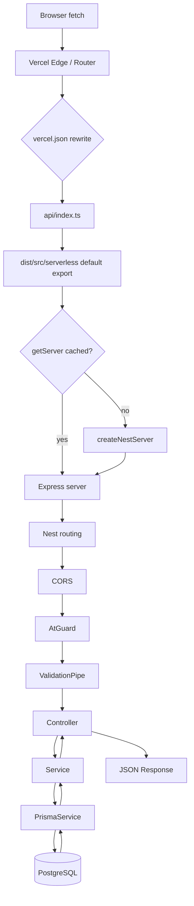
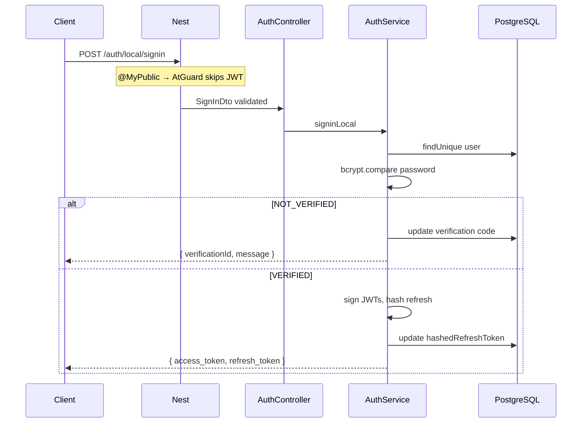

# Request Lifecycle (Extreme Detail)

This traces **one HTTP request** from the React frontend to PostgreSQL and back, using the **actual code paths** in this repository.

---

## Overview diagram



---

## Step 1 — Request enters Vercel

The browser sends e.g.:

```http
GET /employees?skip=0&take=10
Authorization: Bearer eyJhbGciOi...
Origin: https://hrdashboardai.netlify.app
```

Vercel routes the project as a **serverless Node function**, not a long-running VM.

---

## Step 2 — Rewrite handling (`vercel.json`)

```json
"rewrites": [{ "source": "/(.*)", "destination": "/api/index" }]
```

**Meaning:** Every path (`/employees`, `/docs`, `/auth/local/signin`) hits the **same** function at `api/index.ts`.

**Why:** Nest is a full framework with its own router; one Express app handles all routes instead of one Vercel function per route.

**Important:** Paths under `/api/*` on Vercel often mean “another serverless file.” This project intentionally mounts Swagger at `/docs`, not `/api/docs`.

---

## Step 3 — `api/index.ts`

```typescript
import handler from '../dist/src/serverless';
export default handler;
```

- Vercel compiles/bundles this file.
- It imports the **built** handler from `dist/` (produced by `npm run vercel-build`).
- `includeFiles: "{dist/**,generated/**}"` ensures Prisma client is packaged.

If `dist` is missing or stale → runtime import failure.

---

## Step 4 — `serverless.ts` handler

```typescript
const server = await getServer();
server(req, res);
```

### 4a. Cold start path

1. `cachedServer` is null → `createNestServer()`.
2. `express()` creates raw Express app.
3. `NestFactory.create(AppModule, new ExpressAdapter(server))` mounts Nest on Express.
4. `configureApp(app)` — pipes, CORS, Swagger.
5. `app.init()` — registers routes, connects modules; triggers `PrismaService.onModuleInit()` → `$connect()`.
6. `cachedServer = server` for reuse.

**Cold start cost:** Full Nest bootstrap + DB connect (hundreds of ms to seconds).

### 4b. Warm path

`cachedServer` exists → request goes straight to Express with **no** re-bootstrap.

### 4c. Concurrent cold starts

`initPromise` deduplicates parallel first requests so only one bootstrap runs.

---

## Step 5 — Nest bootstrap (`AppModule`)

`AppModule` imports all feature modules and registers:

```typescript
{ provide: APP_GUARD, useClass: AtGuard }
```

Every route hits `AtGuard` first unless marked public.

---

## Step 6 — `app.config.ts` (not middleware file)

Applied once at bootstrap:

### 6a. `ValidationPipe` (global)

- `whitelist: true` — strips unknown properties from body/query.
- `transform: true` — casts query strings to numbers/booleans per DTO.
- `forbidNonWhitelisted: true` — 400 if client sends extra fields.

### 6b. CORS

- Allows origins: `localhost:5173`, `hrdashboardai.netlify.app`.
- Methods include `OPTIONS`, `PATCH` (needed for vacations).
- `optionsSuccessStatus: 204` for preflight.

**OPTIONS / preflight:** Browser sends OPTIONS before cross-origin POST with `Authorization`. CORS runs **before** guards; no JWT required on OPTIONS. `AtGuard` is not invoked for OPTIONS in typical Nest+CORS flow when preflight succeeds.

### 6c. Swagger

- UI: `/docs`
- JSON: `/docs-json`
- Writes `swagger-spec.json` to disk when filesystem allows.

---

## Step 7 — Middleware

This project does **not** define `app.use()` custom middleware beyond what Nest/CORS/Swagger add internally.

---

## Step 8 — Guards

### `AtGuard` (global)

```typescript
if (isPublic) return true;
return super.canActivate(context); // AuthGuard('jwt')
```

For `GET /employees`:

1. No `@MyPublic()` → JWT required.
2. Passport `AtStrategy` extracts Bearer token, verifies with `AT_SECRET`, checks `exp`.
3. `validate()` returns payload → attached as **`req.user`**:

```typescript
{ sub: string, email: string, role: UserRole }
```

Failure → **401 Unauthorized** (Nest/Passport default).

### `RolesGuard` (route-level)

On `UsersController` and employee write routes:

- Reads `@Roles(...)` metadata.
- Compares `req.user.role` using numeric hierarchy (`ADMIN`=1, `SUPER_ADMIN`=2).
- Failure → **403 Forbidden**.

Order: Global guard runs first; route guards run after access token is valid.

---

## Step 9 — Validation

For `GET /employees`, query params bind to `EmployeeQueryDto`:

- `@Type(() => Number)` on `skip`, `take`, etc.
- Invalid enum → **400** with validation messages.

---

## Step 10 — Controller

`EmployeesController.findAll(@Query() query: EmployeeQueryDto)` delegates to service. Controller should stay thin (no Prisma calls).

---

## Step 11 — Service

`EmployeesService.findAll`:

1. Destructure filters from DTO.
2. Build `where` object (camelCase API → snake_case DB columns).
3. `findMany` with `include` for relations.
4. `count` with same `where`.
5. Return `{ data, meta }`.

---

## Step 12 — Prisma

`PrismaService` uses `PrismaPg` adapter with `pg` pool `max: 1`.

- Each query acquires a client from the pool.
- SQL sent to PostgreSQL over SSL (`rejectUnauthorized: false` for managed DBs like Aiven).

---

## Step 13 — PostgreSQL

Executes `SELECT` with JOINs from Prisma `include`. Returns rows → mapped to JS objects.

---

## Step 14 — Response to frontend

Nest serializes return value as JSON:

```json
{
  "data": [ { "id": 1, "name": "...", "Department": { ... } } ],
  "meta": { "total": 120, "skip": 0, "take": 10, "pages": 12 }
}
```

**No** `{ success: true, data: ... }` wrapper — frontend must expect raw shapes.

Errors become:

```json
{
  "statusCode": 401,
  "message": "Unauthorized",
  "error": "Unauthorized"
}
```

---

## Example: Public sign-in (different path)



---

## Teaching checklist

| Step | Student should know |
|------|---------------------|
| Rewrite | One function serves all routes |
| Cached server | Why warm requests are faster |
| `configureApp` | Single config for local + Vercel |
| AtGuard | Default-deny API security |
| ValidationPipe | DTOs are not just documentation |
| Service layer | Where business rules live |
| Prisma `include` | How nested JSON is produced |

See also: [BACKEND_AUTH_SYSTEM.md](./BACKEND_AUTH_SYSTEM.md), [BACKEND_SERVERLESS_ANALYSIS.md](./BACKEND_SERVERLESS_ANALYSIS.md).
