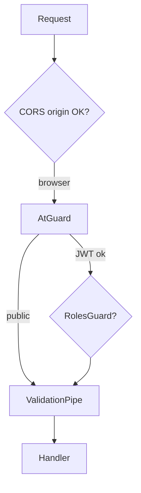

# Security Analysis

Educational review of **real** security controls and gaps in this codebase.

---

## What is implemented

### JWT security

| Control | Implementation |
|---------|----------------|
| Signed tokens | `JwtService.signAsync` with separate secrets |
| Expiry enforced | `ignoreExpiration: false` in strategies |
| Access vs refresh separation | Different secrets and guards |
| Payload minimal | `sub`, `email`, `role` only |

**Gap:** No token blocklist for access tokens (logout only clears refresh hash — access still valid until expiry).

### Password hashing

```typescript
bcrypt.hash(data, 10)  // auth.service hashData
bcrypt.compare(dto.password, user.hashedPassword)
```

**Why bcrypt?** Adaptive cost slows offline cracking.

### Refresh token hashing

Plain refresh never stored; `updateRtHash` saves bcrypt(refresh_token).

**Why?** Stolen DB ≠ usable refresh tokens.

### Role-based access

- Global authentication (`AtGuard`).
- `RolesGuard` with hierarchy for SUPER_ADMIN operations.

### ValidationPipe

- Strips unknown properties (`whitelist`).
- Rejects extra properties (`forbidNonWhitelisted`).
- Type coercion for query params.

### DTO validation

`class-validator` on auth, employees, vacations, attendance DTOs (email format, UUID, min length, enums).

### CORS allowlist

Only known frontend origins; blocks random sites calling API from browser (does not stop curl/Postman).

---

## Risks and missing protections

### 1. User hash leak (`GET /users`)

`UsersService.findAll` / `search` return full Prisma `Users` objects including:

- `hashedPassword`
- `hashedRefreshToken`
- possibly `verificationCode`

**Impact:** SUPER_ADMIN client compromise exposes password hashes.  
**Fix:** Map to `UserResponseDto` with explicit `select`.

### 2. Vacation admin spoofing

`PATCH /vacations/:id/process` accepts `adminId` in **body**, not from `req.user.sub`.

**Impact:** Any authenticated user could attribute approval to another admin UUID.  
**Fix:** `processed_by: req.user.sub` + role check for admin.

### 3. No rate limiting

Sign-in, verify, resend, reset have no throttling.

**Impact:** Brute force OTP (5 digits = 90k space), email spam, DoS.  
**Fix:** `@nestjs/throttler` or edge rate limits.

### 4. Short access token without documented client refresh

5-minute access TTL requires reliable refresh logic on frontend.

**Impact:** 401 bursts if refresh fails.  
**Fix:** Document + implement interceptor (see FRONTEND_INTEGRATION_GUIDE).

### 5. SSL `rejectUnauthorized: false`

MitM possible on path to DB if attacker controls network.

**Fix:** Use provider CA cert in production.

### 6. OTP in database plaintext

`verificationCode` stored as integer, not hashed.

**Impact:** DB read exposes active OTP.  
**Fix:** Hash OTP like passwords.

### 7. No audit logging

Admin actions (delete user, approve vacation) not logged to separate audit table.

### 8. Employee endpoints readable by any authenticated admin

`GET /employees` only needs valid JWT — no role restriction.

**Design choice?** If only SUPER_ADMIN should see HR data, add `@Roles`.

### 9. `hashedAccessToken` column unused

Dead schema field — confusing for security reviews.

---

## ValidationPipe — why it matters

Without it, attackers could send:

```json
{ "email": "a@b.com", "password": "x", "isAdmin": true }
```

`forbidNonWhitelisted: true` → **400** before service runs.

---

## Guards — defense in depth



---

## Security teaching summary

| Question | Answer for this project |
|----------|-------------------------|
| Are passwords safe at rest? | Yes (bcrypt) |
| Are refresh tokens safe at rest? | Yes (bcrypt hash) |
| Is API open by default? | No (global JWT) |
| Is it production-hardened? | Partial — see gaps above |
| Biggest demo risk? | Users hash leak + vacation adminId |

See [BACKEND_RUNTIME_ISSUES.md](./BACKEND_RUNTIME_ISSUES.md) for operational failures.
