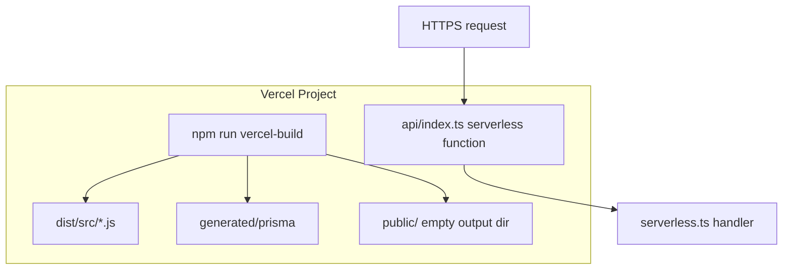

# Serverless Architecture Analysis

## Why serverless was used

| Benefit | For this project |
|---------|------------------|
| No server management | Good for demos / university deployment |
| Git → Vercel deploy | Easy sharing with frontend team |
| Scale to zero | Low cost when idle |
| Single entry | One Nest app serves all routes via rewrite |

| Cost | Impact |
|------|--------|
| Cold starts | Slow first request after idle |
| Connection limits | PostgreSQL max connections stressed |
| Stateless illusion | Must cache Nest instance + limit pool size |
| 30s max duration | Long reports could timeout (`maxDuration: 30`) |

---

## How Vercel runs this project



`vercel.json`:

- `buildCommand`: `vercel-build`
- `outputDirectory`: `public` (static; API is separate function)
- `functions.api/index.ts`: 1024MB, 30s timeout, includes `dist/**` and `generated/**`
- **Rewrite:** all paths → `/api/index`

---

## `api/index.ts` role

Thin bridge:

```typescript
import handler from '../dist/src/serverless';
export default handler;
```

Vercel invokes this as the **serverless function**. It must import **compiled** JS from `dist/`, not TypeScript from `src/` directly.

---

## `serverless.ts` role

1. **`createNestServer()`** — Express + Nest + `configureApp` + `app.init()`.
2. **`getServer()`** — Returns cached Express app or awaits single `initPromise`.
3. **`handler(req, res)`** — Forwards raw Node req/res to Express.

**Why Express adapter?**

Vercel gives Node `IncomingMessage`/`ServerResponse`. Nest normally uses Express (or Fastify); adapter integrates with Vercel's model.

---

## Cached server pattern

```typescript
let cachedServer: Express | null = null;
let initPromise: Promise<Express> | null = null;
```

| Scenario | Behavior |
|----------|----------|
| First request (cold) | Full bootstrap, set cache |
| Parallel cold requests | Share `initPromise` |
| Warm request | Reuse `cachedServer`, no bootstrap |
| Init failure | `initPromise` cleared, retry next time |

**Why cache?**

Nest bootstrap is expensive. Re-running it per request would make API unusable.

**Limitation:** Cache is **per serverless instance**, not global. 100 concurrent instances = 100 Nest apps = up to 100 DB connections if each connects with `max: 1`.

---

## Cold starts

**Symptoms:**

- First request after idle: 2–10+ seconds.
- Logs: `[Serverless] Cold start: creating Nest application...`

**What happens:**

1. Load JS bundle.
2. Create Nest DI container.
3. Register all modules, strategies, guards.
4. Swagger document generation.
5. `PrismaService.$connect()`.

**Production impact:** Poor UX on first dashboard load; mitigated by periodic ping (not implemented) or always-warm plans.

---

## Prisma connection issues on serverless

### Traditional hosting

One long-running Node process → one pool → stable connections.

### Serverless

Many short-lived **instances**, each may:

- Call `$connect()` on bootstrap.
- Hold pool until instance frozen/killed.

### This project's mitigations

1. **`globalForPrisma` singleton** — one PrismaService per instance.
2. **`max: 1`** on `pg` pool — cap connections per instance.

### Without mitigations

Symptom: PostgreSQL error **“sorry, too many clients already”**  
Prisma may surface as **`P2037`** (depending on version/message): *Too many database connections opened*.

---

## P2037 — deep explanation

**What it is:** Prisma/client cannot obtain a connection from the pool or server rejected new connection because **Postgres `max_connections`** is exhausted.

**Causes in serverless + Prisma:**

| Cause | Mechanism |
|-------|-----------|
| Traffic spike | N Vercel instances × pool size each |
| Connection leak | `$connect` without `$disconnect`, instances accumulate |
| Large default pool | Before `max: 1`, pg default ~10 per instance |
| Long cold start overlap | Many simultaneous bootstraps |
| Other clients | pgAdmin, seeds, local dev sharing same DB |

**Runtime behavior:**

- Random 500 errors on API.
- Works locally (single process) but fails in production.
- May recover when instances scale down.

**Solutions (production-grade):**

1. **Connection pooler** — PgBouncer, Neon pooler, Supabase pooler, Prisma Accelerate.
2. **Lower per-instance pool** — already `max: 1` here.
3. **Limit Vercel concurrency** — platform settings.
4. **Separate DB for serverless vs scripts** — avoid dev stealing connections.
5. **Use HTTP/database proxy products** designed for serverless.

**What students should say in viva:**

> “Serverless multiplies processes; each process needs DB connections. We singleton Prisma and set pg `max: 1`, but under high load we still need an external pooler.”

---

## How serverless differs from `main.ts` local

| Aspect | Local `main.ts` | Vercel `serverless.ts` |
|--------|-----------------|-------------------------|
| Entry | `NestFactory.create` + `listen` | Express adapter, no `listen` |
| HTTP server | Nest owns port 3000 | Vercel invokes handler |
| Included in build | Yes (default tsconfig) | `main.ts` **excluded** in `tsconfig.vercel.json` |
| Lifecycle | Runs until Ctrl+C | Freezes between invocations |
| Swagger | Same `/docs` via `configureApp` | Same |

---

## Why `main.ts` is excluded from Vercel build

`tsconfig.vercel.json`:

```json
"exclude": [ ..., "src/main.ts", ... ]
```

**Reason:** Vercel entry is `api/index.ts` → `serverless.ts`. Building `main.ts` would:

- Pull `app.listen` code not used on Vercel.
- Risk wrong start script if someone ran `node dist/src/main.js` on Vercel expecting serverless.

**Historical failure:** Deploying expecting `dist/src/main.js` as serverless handler → process exits or wrong export → **function failures**. Correct pattern: **only** `serverless` default export handles HTTP.

---

## Swagger on serverless

`configureApp` mounts `/docs` (not `/api/docs`) because `/api/*` is reserved for the function path on Vercel.

Students can open `https://<deployment>/docs` on production.

---

## Build flow

```bash
npm run vercel-build
# → nest build -p tsconfig.vercel.json
# → mkdir public
```

`postinstall` → `prisma generate` ensures `generated/prisma` exists on Vercel build machines.

See [BACKEND_DEPLOYMENT_GUIDE.md](./BACKEND_DEPLOYMENT_GUIDE.md).
